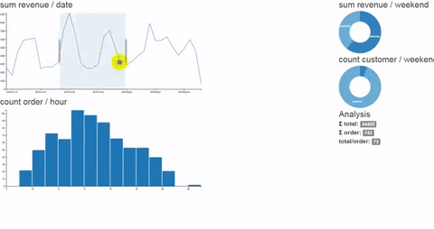

#github contrinution calendar graph is cool
I have tried `git-cal`, `git-stats`, `ghcal`, `gitfiti`.

At the last try, i choose `cal-heatmap`. Silly, until this library, I realize that github contribution graph use `heat-map` style @@.

[`cal-heatmap`](https://github.com/wa0x6e/cal-heatmap) has a good documentation, really easy for me to start with.

#demo

